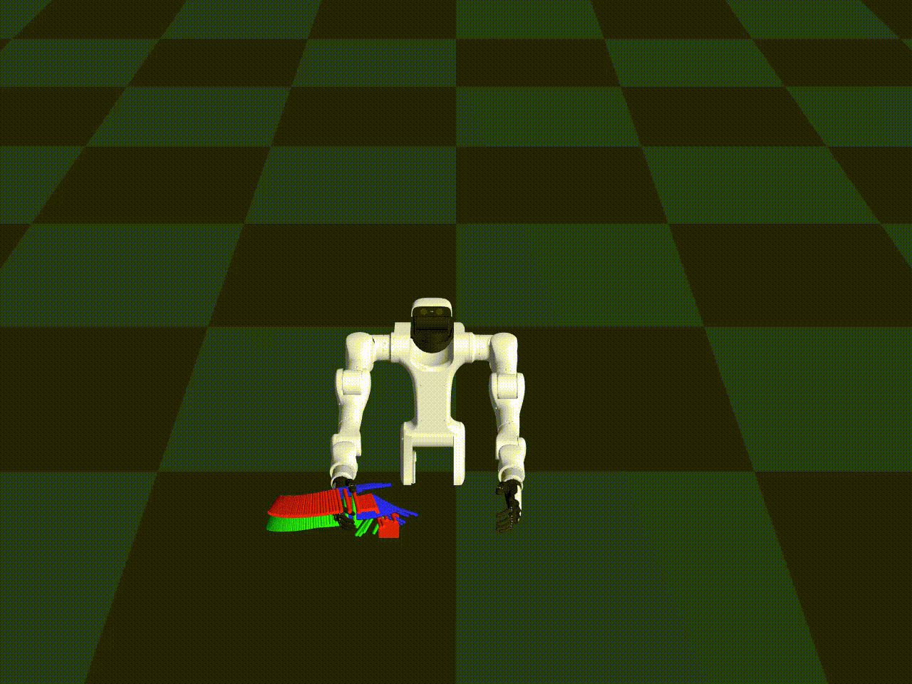
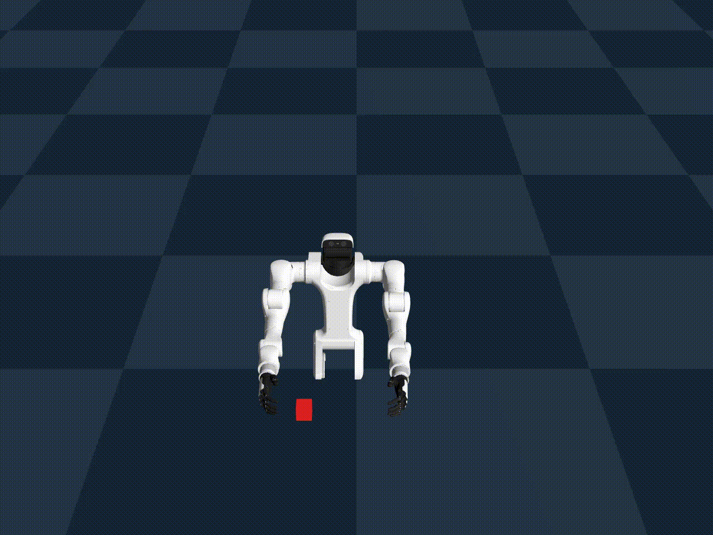

# Vega Manipulation Demo

A demonstration of robotic manipulation using the Vega humanoid robot in the Genesis physics engine. This project showcases inverse kinematics, path planning, and grasping motions for robotic manipulation tasks.

## Demo Videos

### Basic Manipulation Demo


### Debug Visualization Demo  


*Note: The videos show the robot reaching for and grasping a red cube target. The debug version includes path visualization to show the planned motion trajectory.*

## Overview

The Vega Manipulation Demo is a Python-based robotic simulation that demonstrates:

- **Robot Setup**: Loading and configuring the Vega humanoid robot
- **Inverse Kinematics**: Computing joint configurations to reach target positions
- **Path Planning**: Generating smooth trajectories for robot motion
- **Grasping**: Executing hand closing motions to grasp objects
- **Simulation**: Running physics-based simulations with Genesis

## Features

- **Modular Design**: Clean, well-documented code following Google Python style guide
- **Configurable Parameters**: Easy-to-modify joint configurations and simulation settings
- **Debug Visualization**: Optional path visualization for development and debugging
- **Video Recording**: Built-in camera recording capabilities for demonstrations
- **Command Line Interface**: Flexible command-line options for different use cases

## Prerequisites

- Python 3.10 or higher
- CUDA-compatible GPU
- Conda or Miniconda

## Installation

### 1. Create Conda Environment

```bash
# Create a new conda environment
conda create -n vega_demo python=3.10

# Activate the environment
conda activate vega_demo
```

### 2. Install Project

```bash
# Install the projects including torch etc
git clone https://github.com/YilangLiu/dex_hw.git
cd dex_hw
pip install -e .
```

### 3. Install External Libraries

```bash
git clone https://github.com/Genesis-Embodied-AI/Genesis.git
cd Genesis
pip install -e ".[dev]"
```
```shell
# Return to the main project directory
cd ..
git clone https://github.com/dexmate-ai/dexmate-urdf.git
cd dexmate-urdf
pip install dexmate_urdf

# Install RSL Library 
pip install rsl-rl-lib==2.2.4
```

## Usage

### Basic Usage

```bash
# Run the demo with default settings
python vega_manipulation_demo.py

# Show the viewer during simulation
python vega_manipulation_demo.py --vis

# Enable debug visualization
python vega_manipulation_demo.py --debug

# Record the simulation to video
python vega_manipulation_demo.py --record

# Combine multiple options
python vega_manipulation_demo.py --vis --debug --record

# Train RL agent 
python python3 train_vega.py

# Evaluate RL agent 
python python3 eval_vega.py
```

### Command Line Options

- `-v, --vis`: Show the viewer during simulation
- `-d, --debug`: Enable debug visualization (shows planned path)
- `-r, --record`: Record the simulation to video file
- `-h, --help`: Show help message
